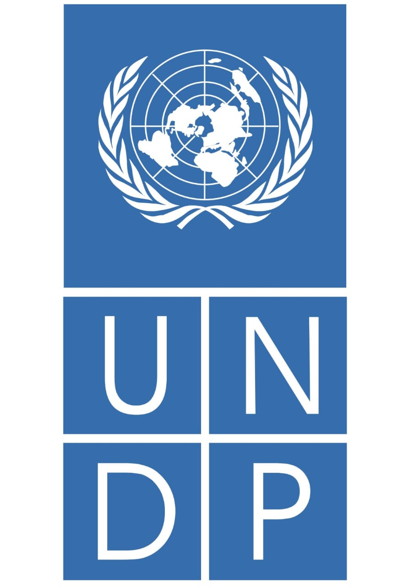
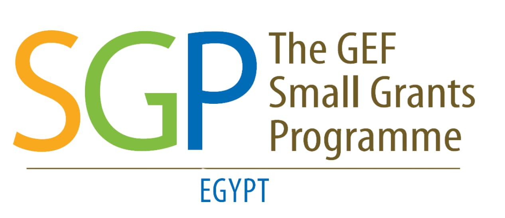
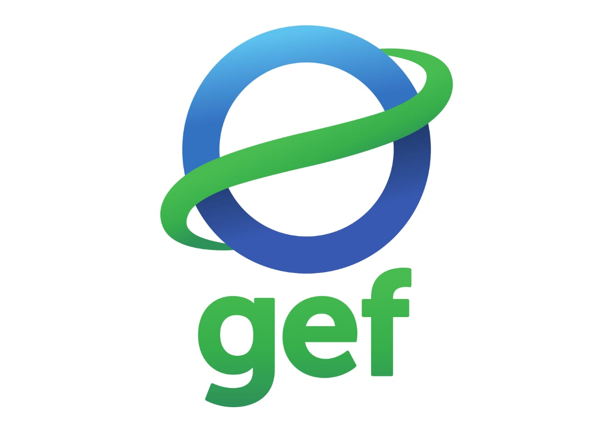
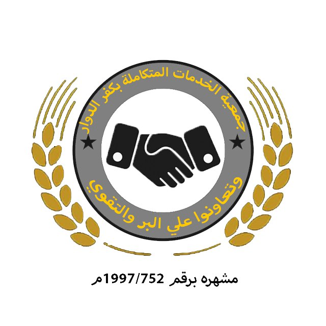
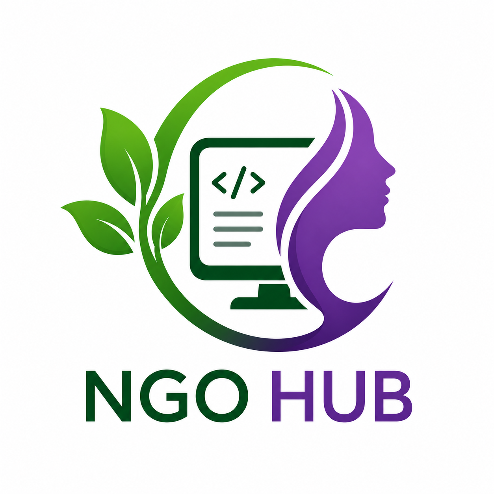
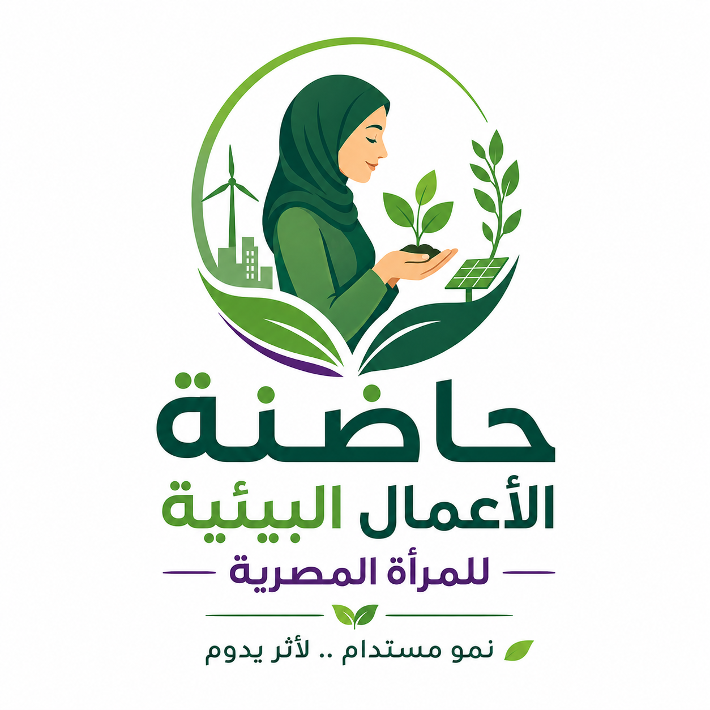
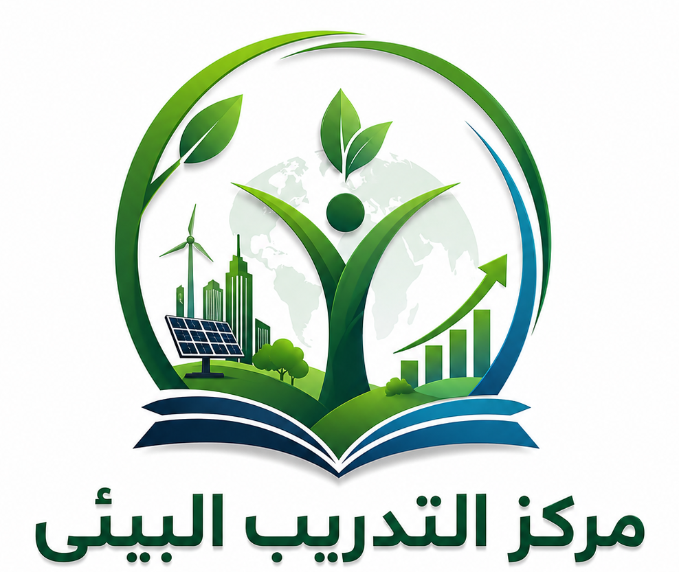
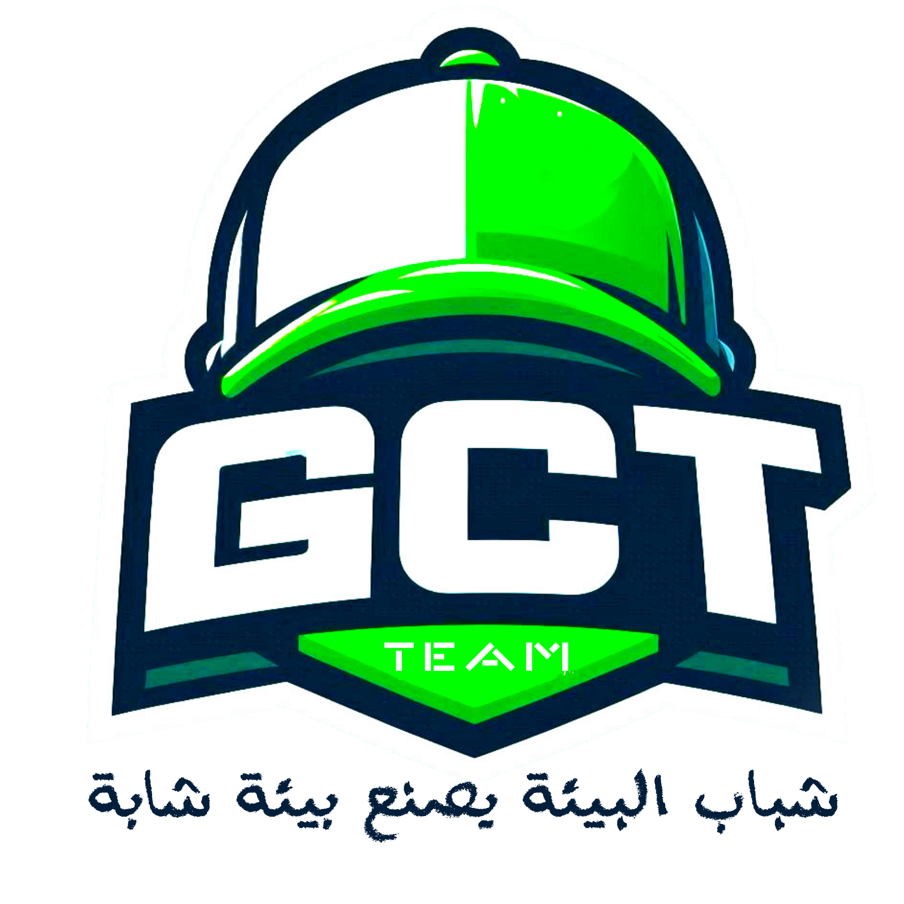
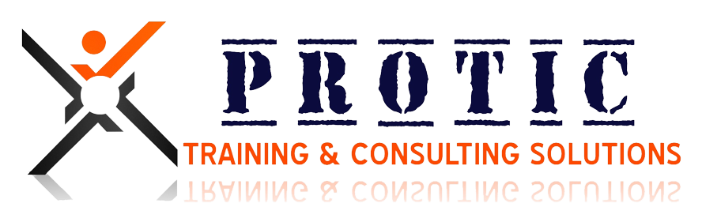

# 🌿 تكنولوجيا الأعلاف البديلة .. أزولا مصر
## Azolla Egypt – Alternative Feed Technology & Sustainable Agriculture
### 🏆 مشروع تكنولوجيا الأعلاف البديلة .. أزولا مصر | تمويل برنامج المنح الصغيرة (SGP/GEF/UNDP) | تنفيذ جمعية الخدمات المتكاملة بكفر الدوار ومزارع أسوان

[](https://ngohub.github.io/azolla/)
[](https://ngohub.github.io/azolla/)
[](https://ngohub.github.io/azolla/)
[](https://docs.google.com/spreadsheets/d/1xHfcJ15TNM6wK2zjkqGtBrz2TWLCy-H-Q1Ccm96_pxI/)

---

### 🌐 رابط المنصة المباشر والحي:
👉 **[https://ngohub.github.io/azolla/](https://ngohub.github.io/azolla/)**

---

## 📌 الملخص التنفيذي للمشروع (Executive Brief):

مشروع **«تكنولوجيا الأعلاف البديلة .. أزولا مصر»** هو منظومة تنموية زراعية وبيئية ومناخية وطنية متكاملة ومطبقة ميدانياً في جمهورية مصر العربية (كفر الدوار بمحافظة البحيرة ومزارع فرع أسوان التكاملية)، تهدف إلى **إنتاج سرخس الأزولا الطافي عالي البروتين (25% - 35%) كبديل علفي مستدام يخفض تكاليف الأعلاف التقليدية بنسبة تصل إلى 60%** لمربي الماشية والدواجن والأسماك.

يحظى المشروع بدعم وتمويل مباشر من **برنامج المنح الصغيرة بمصر (SGP Egypt)** المنبثق عن **مرفق البيئة العالمية (GEF)** وتحت مظلة **برنامج الأمم المتحدة الإنمائي (UNDP)**، وتقوم على تنفيذه وإدارته الميدانية **جمعية الخدمات المتكاملة بكفر الدوار** (إشهار رقم 1997/752)، بالشراكة التقنية والرقمية مع منصة **NGO HUB**.

---

## 💡 ماذا يقدم مشروع "أزولا مصر"؟ (Core Value Offerings):

### 1. 🌾 بديل علفي أخضر عالي البروتين وخفض 60% من التكاليف:
* إنتاج يومي مستمر لسرخس الأزولا الطافي الغني بالأحماض الأمينية والمعادن والفيتامينات.
* خفض تكاليف الأعلاف المركبة بنسبة **40% إلى 60%** في مزارع الأبقار والجاموس والأغنام والدواجن والأسماك.

### 2. ☀️ الطاقة النظيفة والري المستدام (Solar Pumping):
* تشغيل **3 محطات طاقة شمسية** بقدرة إجمالية **25 كيلووات (kW)** لضخ المياه بنسبة طاقة نظيفة تتجاوز **90%**.
* ضخ **2,350 م³/يوم** لخدمة **66 فداناً زراعياً** و**8 أفدنة سمكية**.
* توفير **10,200 لتر سولار سنوياً** وخفض الانبعاثات بمعدل **108 طن CO₂e سنوياً**.

### 3. 👩‍🌾 التمكين الاقتصادي للمرأة الريفية ووحدات الأسطح:
* تأهيل وتدريب **512 مستفيداً ومستفيدة** (بنسبة **62% إناث** و**25% شباب** و**10% ذوو همم).
* إنشاء وحدات أسطح منزلية منتجة تحقق دخلاً إضافياً متوسطه **3,800 ج.م شهرياً** (النموذج التطبيقي لوحدات الأسطح المنزلية 30 م²).

### 4. 🤝 الشراكة الزراعية الميدانية والتطوع:
* إتاحة التقديم لملاك الأراضي الزراعية للمشاركة في إنشاء أحواض ومزارع كبرى.
* فتح باب التطوع وسفراء البيئة لشباب الجامعات مع مبادرة **Green Cap Team (GCT)**.

---

## 🏛️ الشركاء المؤسسيون والرعاة الرسميون (Partners Matrix):

| الشعار | الجهة / المنظمة | التصنيف المؤسسي | الدور والمسؤولية |
| :---: | :--- | :--- | :--- |
|  | **برنامج الأمم المتحدة الإنمائي (UNDP)** | جهة راعية ومانحة دولية | الدعم التنموي والتمكين المناخي وحماية الموارد المائية |
|  | **برنامج المنح الصغيرة (SGP Egypt)** | جهة التمويل المباشر | الممول التنموي الرئيسي للمشروع بمصر |
|  | **مرفق البيئة العالمية (GEF)** | المظلة البيئية الدولية | تمويل صون التنوع البيولوجي وخفض الانبعاثات الكربونية |
|  | **جمعية الخدمات المتكاملة بكفر الدوار** | الجهة التنفيذية والميدانية | الإدارة الزراعية، توفير التقاوي، الإشراف الفني ومزارع كفر الدوار وأسوان |
|  | **منصة ومبادرة NGO HUB** | الشريك التكنولوجي والمنصة | تطوير وتصميم المنصة الرقمية، وبرمجة الحاسبات الزراعية الذكية |
|  | **حاضنة الأعمال البيئية للمرأة المصرية** | التمكين الاقتصادي للمرأة | تأهيل السيدات الريفيات لإنشاء وحدات الأسطح المنزلية |
|  | **مركز التدريب البيئي** | التدريب وبناء القدرات | تقديم البرامج التطبيقية وتخريج المدربين المعتمدين (TOT) |
|  | **مبادرة Green Cap Team (GCT)** | المبادرات الشبابية والتطوع | فريق شباب البيئة للتوعية الحقلية وورش العمل بالقرى |
|  | **PROTIC Solutions** | الاستشارات وتطوير التدريب | تطوير الحقائب التدريبية المتخصصة وبناء الكوادر |

---

## 🛠️ الخصائص والمكونات التقنية للمنصة الرقمية (Digital Platform Features):

### 1. 🧮 الحاسبات الزراعية الذكية (4 Smart Tools):
* **حاسبة مساحات وتصميم الأحواض**: حساب التقاوي، كميات الإنتاج الصيفي والشتوي، والوفر المالي الشهري.
* **حاسبة خلط العلائق**: معادلات نسب خلط الأزولا للأبقار، التسمين، الأغنام، الدواجن، والأسماك.
* **حاسبة الأثر البيئي وخفض الانبعاثات**: حساب أطنان الكربون المتجنبة سنوياً وما يعادلها من أشجار.
* **حاسبة العائد الاستثماري (ROI)**: دراسات جدوى مالية فورية للمزارع المنزلية والمتوسطة والتجارية.

### 2. 🎓 أكاديمية أزولا مصر (12 برنامجاً تدريبياً معتمداً):
* منظومة متكاملة لحجز البرامج التدريبية الميدانية في كفر الدوار وأسوان أو عن بُعد عبر Zoom.

### 3. 📊 الربط التلقائي بـ Google Sheets (5 استمارات ذكية):
جميع استمارات المنصة ترسل لحظياً إلى شيت الإكسيل الرسمي للمشروع عبر Google Apps Script Webhook:
1. **استمارة طلب إنشاء مزرعة / حوض أزولا**.
2. **استمارة التقديم على مشاركة أرض زراعية**.
3. **استمارة التطوع وسفراء البيئة (GCT)**.
4. **استمارة حجز برامج أكاديمية أزولا مصر**.
5. **استمارة التواصل العام والاستشارات الحقلية**.

### 4. 🎛️ لوحة تحكم المحتوى (AZOLLA CMS Dashboard):
* دخول آمن مع زر إغلاق `(X)`، وتعديل الإحصائيات، ورفع الصور مباشرة (`Base64 FileReader`)، وإدارة صندوق الوارد والنسخ الاحتياطي (`JSON Backup`).

### 5. 🌗 محرك الوضعين (Dark / Light Mode):
* دعم كامل ومريح للقراءة الليلية والنهارية مع حفظ التفضيل تلقائياً للمستخدم.

---

## 📁 الهيكل المعماري للمستودع (Repository Structure):

```text
azolla/
├── 📁 assets/                          # الأصول الرقمية والتصميم
│   ├── 📁 css/                         # ملفات التنسيق والتجاوب (style.css)
│   ├── 📁 images/                      # الشعارات الرسمية والصور التوثيقية والأنشطة
│   └── 📁 js/                          # الأكواد المجمعة وموجه الصفحات (app.js, data.js)
├── 📁 docs/                            # الوثائق المرجعية ومواصفات المشروع
│   ├── 📁 guides/                      # الأدلة الرسمية الخاصة بالمبادرة الوطنية
│   └── 📁 specs/                       # وثيقة المشروع والمواصفات المعتمدة (Master Brief)
├── 📁 pages/                           # المكونات البرمجية التفصيلية للصفحات الـ 9
├── 📁 tests/                           # حزم الاختبارات التلقائية الشاملة (test_webhook.py)
├── 📁 .github/workflows/               # مسار النشر السحابي التلقائي (static.yml)
├── 📄 index.html                       # الملف الرئيسي للمنصة SPA
├── 📄 README.md                        # الدليل التعريفي الشامل للمبادرة
├── 📄 UPDATES.md                       # السجل المركزي الموحد لكافة التحديثات
└── 📄 .nojekyll                        # ملف ضبط وتوافق خوادم GitHub Pages
```

---

## 📞 قنوات التواصل والاستفسارات الرسمية (Official Contact)
 
* 🏢 **المقر التنفيذي والميداني**: جمعية الخدمات المتكاملة – كفر الدوار، محافظة البحيرة (إشهار 1997/752).
* 🌴 **مزارع الإنتاج ومحطات الطاقة الشمسية**: مزارع كفر الدوار ومزارع فرع أسوان التكاملية.
* 📞 **الاتصال الهاتفي (تواصل تليفون فقط)**: `01553335579` / `0452182834`
* 📱 **الواتساب المعتمد**: `01011526504` ([محادثة واتساب مباشرة](https://wa.me/201011526504))
* ✉️ **البريد الإلكتروني الرسمي**: `protic1613@gmail.com`
* 🌐 **بوابة التقديم والاستفسارات الإلكترونية**: [https://azollaeg.github.io/](https://azollaeg.github.io/)

---

## 📜 حقوق الملكية والترخيص (License & Copyright)

جميع حقوق الملكية الفكرية وتطوير المحتوى محفوظة لـ **مشروع تكنولوجيا الأعلاف البديلة .. أزولا مصر** والجهات الشريكة المنفذة والممولة (SGP / GEF / UNDP / جمعية الخدمات المتكاملة / NGO HUB). هذا المشروع متاح للأغراض التنموية الزراعية ونشر المعرفة البيئية وتمكين المربين والمزارعين في جمهورية مصر العربية.

---
© 2026 **مشروع تكنولوجيا الأعلاف البديلة .. أزولا مصر** | تنفيذ **جمعية الخدمات المتكاملة بكفر الدوار** ومزارع **أسوان** | الشريك الرقمي: **NGO HUB**.
