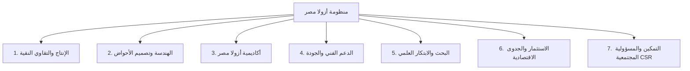
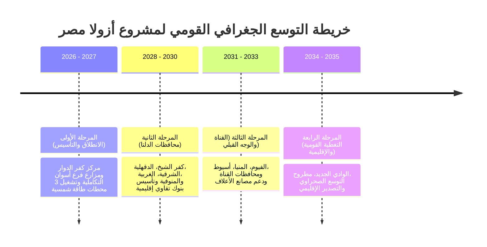

# الملف المرجعي الشامل لتصميم وتطوير وتوثيق مشروع «أزولا مصر – ذهب مصر الأخضر»
**Master Content, UX, Design & Development Brief - v5.0**

> **بيان اعتماد:** جميع البيانات والأرقام والإحصائيات الواردة في هذا الملف معتمدة رسمياً من إدارة مشروع **«أزولا مصر»** ورعاته المؤسسيين: **برنامج المنح الصغيرة (SGP Egypt)** – **مرفق البيئة العالمية (GEF)** – **برنامج الأمم المتحدة الإنمائي (UNDP)**، وبالتعاون التنفيذي مع **جمعية الخدمات المتكاملة بكفر الدوار** ومزارع فرع **أسوان التكاملية**.

---

## 1. بطاقة التعريف الأساسية بالمشروع (Project Metadata)

* **اسم المشروع بالعربية:** أزولا مصر – ذهب مصر الأخضر
* **اسم المشروع بالإنجليزية:** Azolla Egypt – Egypt's Green Gold
* **شعار المشروع (Slogan):** "من نبات صغير فوق الماء… نصنع مستقبلًا أخضر لمصر"
* **نوع التوثيق:** Document Master Reference & Web Architecture Specification
* **الجهة التنموية المُمولة:** برنامج المنح الصغيرة (SGP Egypt) – مرفق البيئة العالمية (GEF) – برنامج الأمم المتحدة الإنمائي (UNDP)
* **الجهة التنفيذية الرئيسية:** جمعية الخدمات المتكاملة بكفر الدوار (محافظة البحيرة)
* **المقر الرئيسي والعمليات الميدانية:** مركز كفر الدوار – محافظة البحيرة – ومزارع فرع أسوان التكاملية
* **شركاء التكنولوجيا والتطوير:** PROTIC Training & Consulting Solutions – Global Clean Tech (GCT)
* **النطاق المباشر للمشروع:** التنمية الزراعية، الاقتصاد الأخضر، تخفيض تكاليف الأعلاف، التمكين المجتمعي والمرأة، وطاقة الضخ النظيفة.
* **النطاق الجغرافي للانتشار:** محافظة البحيرة، محافظة أسوان، وخطة التوسع القومية 2035.
* **الموقع الإلكتروني الرسمي:** [https://azollaegypt.org](https://azollaegypt.org)

---

## 2. الرؤية والرسالة والأهداف الاستراتيجية

### 👁️ الرؤية (Vision)
أن تصبح مصر مركزاً إقليمياً ورائداً في إنتاج وتطوير تقنيات الأزولا، وتوفير عليقة علفية مكملة ومستدامة، ودعم خصوبة التربة وتحقيق الأمن الغذائي والمناخي بحلول عام 2035.

### 🎯 الرسالة (Mission)
نشر المعرفة وتوطين تكنولوجيا استزراع الأزولا، وتقديم خدمات التصميم، والتدريب العملي، والدعم الفني الميداني، والشراكات الاستثمارية والمجتمعية لبناء نماذج زراعية خضراء واعدة تعزز دخل الأسر الريفية وتحمي البيئة.

### 📌 الأهداف الاستراتيجية الكبرى:
1. **توفير حلول علفية اقتصادية:** تخفيض تكاليف الأعلاف المركبة بنسب تصل إلى 60% لدى مزارعي الماشية والدواجن والأسماك.
2. **التمكين المجتمعي والتنموي:** تحسين دخل الأسر الريفية بمتوسط زيادة 3,800 جنيه شهرياً، ومساعدة 80% من المشاركين على التعافي من خط الفقر المدقع.
3. **التمكين النوعي:** تخصيص 62% من فرص التدريب والتأسيس لصالح المرأة الريفية، و25% للشباب، و10% لذوي الهمم.
4. **العمل المناخي والاستدامة (ESG):** خفض 108 أطنان من الانبعاثات الكربونية سنوياً، وتوفير 10,200 لتر سولار بالاعتماد على الطاقة الشمسية.
5. **نقل المعرفة والابتكار:** إعداد وتأهيل أكثر من 500 خريج معتمد عبر «أكاديمية أزولا مصر».

---

## 3. الإحصائيات والإنجازات الميدانية المعتمدة (SGP/GEF/UNDP Certified 2026)

| المعيار / المؤشر الميداني | الإحصائية المعتمدة | التاصيل والتفصيل الميداني |
| :--- | :--- | :--- |
| **محطات الطاقة الشمسية** | 3 محطات بقدرة 25 kW | تشغيل أكثر من 90% من عمليات الضخ بالطاقة النظيفة |
| **سعة ضخ المياه اليومية** | 2,350 متر مكعب / يوم | خدمة 66 فداناً نباتياً و8 أفدنة مزارع سمكية |
| **المستفيدون المباشرون من التدريب** | 512 مستفيداً | 62% إناث \| 25% شباب \| 10% ذوو همم |
| **التوعية المجتمعية المباشرة** | 1,430 مشاركاً | عبر 26 ورشة عمل وحملة ميدانية |
| **الوصول غير المباشر** | 7,150 مستفيداً | أسر المزارعين والمجتمعات المحيطة بكفر الدوار وأسوان |
| **نسبة خفض تكلفة الأعلاف** | حتى 60% | في علائق الأبقار والجاموس والأغنام والدواجن والأسماك |
| **فرص العمل المباشرة** | +75 فرصة عمل | وظائف دائم للمزارعين والفنيين والمدربات |
| **زيادة متوسط الدخل الشهري** | +3,800 جنيه مصري | متوسط وفر وزيادة إيرادات الأسرة |
| **معدل التعافي من الفقر المدقع** | 80% | للأسر المشاركة في برامج المرأة الخضراء والأحواض المنزلية |
| **خفض الانبعاثات الكربونية** | 108 طن CO₂e / سنوياً | مكافئ لزراعة 4,860 شجرة تنمو لمدة عام |
| **توفير الوقود الأحفوري (السولار)** | 10,200 لتر / سنوياً | استبدال مضخات الديزل بطاقة الضخ الشمسية |

---

## 4. المحاور السبعة لمنظومة أزولا مصر (7 System Pillars)

تعتمد المنظومة على التناغم بين 7 محاور أساسية لضمان استدامة الإنتاج والجودة:

1. **المحور الأول: الإنتاج والتقاوي النقية:** توفير تقاوي أزولا موثوقة ونقية مفحوصة معملياً وخالية من الأعشاب والآفات الحشرية.
2. **المحور الثاني: الهندسة وتصميم الأحواض:** رفع المساحات، اختيار العوازل المائية والبطانات، وتصميم أنظمة التظليل والري والضخ الشمسي.
3. **المحور الثالث: أكاديمية أزولا مصر:** تقديم 12 برنامجاً تدريبياً تطبيقيًا لإعداد المزارعين، الفنيين، والمدربين المعتمدين (TOT).
4. **المحور الرابع: الدعم الفني والجودة:** متابعة دورية لجودة المياه، الـpH، والملوحة، ومعالجة مشكلات اللون والنمو طوال الموسم.
5. **المحور الخامس: البحث والابتكار العلمي:** تطوير تقنيات التجفيف، والتعبئة، وإجراء تحاليل المادة الجافة والبروتين بالتعاون مع المراكز البحثية.
6. **المحور السادس: الاستثمار والجدوى الاقتصادية:** تقديم دراسات جدوى محدثة ونماذج شراكة تجارية (مزارع مركزية / مزارع شريكة / امتياز).
7. **المحور السابع: التمكين والمسؤولية المجتمعية (CSR):** دعم الأسر الأكثر احتياجاً، وتمكين المرأة الريفية، وتقديم تقارير قياس الأثر البيئي والاجتماعي.

---

## 5. القاعدة العلمية والتركيب الغذائي للأزولا (Azolla Science)

### 🧬 ما هو نبات الأزولا؟
الأزولا (*Azolla*) سرخس مائي عائم سريع النمو ينتمي للعائلة الأزولية (*Azollaceae*). يرتبط علاقة تكافلية فريدة مع الطحلب الأزرق المأكول (*Anabaena azollae*) الذي يعيش في تجاويف أوراقه، مما يمنحه القدرة على تثبيت النيتروجين الجوي مباشرة وتحويله إلى كتلة حيوية غنية بالبروتين.

### 🌾 السلالات المعتمدة بمصر:
* **Azolla pinnata:** أكثر السلالات ملاءمة للبيئة المصرية وتأقلمًا مع درجات الحرارة الدافئة في الصيف.
* **Azolla filiculoides:** تتميز بمحتوى بروتيني مرتفع وتحمل نسبي للبرودة.
* **Azolla caroliniana & microphylla:** سلالات واعدة للتجارب المعلقة والاستزراع المغلق.

### 🌡️ ظروف النمو البيئية المثالية:
* **درجة الحرارة:** المدى المثالي (20°م إلى 30°م). يلزم التظليل عند تجاوز 35°م وحماية الأحواض من الصقيع شتاءً.
* **عمق المياه:** 10 سم إلى 20 سم (عمق خفيف يقلل استهلاك المياه وتكاليف الإنشاء).
* **الرقم الهيدروجيني (pH):** 5.5 إلى 7.5 (متعادل إلى مائل للقليل من الحموضة).
* **معدل التضاعف:** تتضاعف الكتلة الحيوية كل 3 إلى 7 أيام، مما يتيح حصاد دوري كل يومين إلى 3 أيام.

### 🥗 التحليل الكيميائي والغذائي (على أساس المادة الجافة Dry Matter):
* **البروتين الخام (Crude Protein):** 20% – 35%
* **الألياف الخام (Crude Fiber):** 10% – 15%
* **الدهون (Ether Extract):** 2% – 4%
* **المادة الجافة في النبات الطازج:** 5% – 8%
* **العناصر المعدنية والفيتامينات:** مستويات مرتفعة من الكالسيوم، الحديد، الفوسفور، البوتاسيوم، وحمض الليسين، والبيتاكاروتين.

### 📊 جدول المقارنة التوعوية الإرشادية:

| المعيار | الأزولا (Azolla) | البرسيم (Alfalfa) | كسب فول الصويا (Soybean Meal) |
| :--- | :--- | :--- | :--- |
| **دورة الحصاد والإنتاج** | سريعة جداً (حصاد كل 3-5 أيام) | موسمية (حشات دورية كل 30 يوماً) | محصول كامل (4 - 5 أشهر) |
| **محتوى البروتين الخام** | **20% – 35%** (مادة جافة) | 15% – 22% | 44% – 48% |
| **استهلاك المياه والتربة** | أحواض مغلقة وتدوير مياه | أراضٍ زراعية صالحة للحرث | أراضٍ شاسعة وتسميد كثيف |
| **تثبيت النيتروجين** | تكافلي مباشر مع طحلب الأنابينا | بقولي عبر بكتيريا الجذور | بقولي عبر الجذور |
| **التوصية الاستخدامية** | مكوّن علفي داعم بنسبة 15-30% | علف أخضر ودريس رئيسي | خامة بروتينية مركزة |

---

## 6. معادلات وحاسبات المنظومة التفاعلية (Calculators & Formulas)

### 1️⃣ حاسبة تصميم الأحواض والتقاوي والإنتاج (Basin & Seed Calculator)
* **المساحة المتاحة ($A$):** $A = \text{Length} \times \text{Width} \pmod{\text{m}^2}$
* **احتياج التقاوي الأولية ($S$):** $S = A \times 0.5 \pmod{\text{kg}}$ (بمعدل 500 جرام تقاوي لكل متر مربع).
* **حجم المياه المطلوب ($V$):** $V = A \times 0.15 \pmod{\text{m}^3}$ (عمق مياه 15 سم).
* **الإنتاج اليومي الصيفي ($Y_{\text{summer}}$):** $Y_{\text{summer}} = \frac{A \times 450}{1000} \pmod{\text{kg/day}}$
* **الإنتاج اليومي الشتوي ($Y_{\text{winter}}$):** $Y_{\text{winter}} = \frac{A \times 300}{1000} \pmod{\text{kg/day}}$
* **الوفر الشهري التقديري ($W$):** $W = (Y_{\text{daily}} \times 30) \times 5.0 \pmod{\text{EGP}}$

### 2️⃣ حاسبة خلط عليقة الأعلاف للأبقار والطيور (Feed Ration Calculator)
* **معامل الاستبدال:** 1 كجم علف جاف مركز يستبدل بـ 3.5 إلى 4 كجم أزولا طازجة.
* **الاحتياج اليومي للقطيع ($F_{\text{total}}$):** $F_{\text{total}} = N_{\text{heads}} \times \text{DailyFeedPerHead} \pmod{\text{kg/day}}$
* **العلف الجاف الموفر ($F_{\text{dry\_saved}}$):** $F_{\text{dry\_saved}} = F_{\text{total}} \times \left(\frac{\text{InclusionPct}}{100}\right) \pmod{\text{kg/day}}$
* **الأزولا الطازجة الواجب إضافتها ($F_{\text{azolla\_fresh}}$):** $F_{\text{azolla\_fresh}} = F_{\text{dry\_saved}} \times \text{Ratio}$
* **الوفر المالي اليومي ($S_{\text{daily}}$):** $S_{\text{daily}} = F_{\text{dry\_saved}} \times \text{PricePerKgConcentrate} \pmod{\text{EGP/day}}$

### 3️⃣ حاسبة خفض الانبعاثات الكربونية والبصمة البيئية (Carbon Offset Estimator)
* **انبعاثات الأعلاف المتجنبة ($C_{\text{feed}}$):** $C_{\text{feed}} = \frac{(\text{AzollaTons} \times 250) \times 2.1}{1000} \pmod{\text{Tons CO}_2\text{e}}$
* **انبعاثات الديزل المتجنبة ($C_{\text{diesel}}$):** $C_{\text{diesel}} = \frac{\text{DieselLiters} \times 2.68}{1000} \pmod{\text{Tons CO}_2\text{e}}$
* **إجمالي CO₂e المتجنب ($C_{\text{total}}$):** $C_{\text{total}} = C_{\text{feed}} + C_{\text{diesel}} \pmod{\text{Tons CO}_2\text{e}}$
* **المكافئ من الأشجار المزروعة ($T_{\text{trees}}$):** $T_{\text{trees}} = C_{\text{total}} \times 45 \pmod{\text{Trees}}$

### 4️⃣ حاسبة العائد الاستثماري (ROI Estimator)
* **المزرعة التجارية المتوسطة (0.5 فدان - 2,000 م²):**
  * CAPEX التقديري: 120,000 جنيه مصري.
  * OPEX السنوي التقديري: 35,000 جنيه مصري.
  * الإنتاج السنوي التقديري: ~ 18 طن أزولا طازج.
  * فترة الاسترداد المتوقعة: 12 إلى 16 شهراً.

---

## 7. أكاديمية أزولا مصر والبرامج التدريبية الـ 12

تستهدف الأكاديمية بناء القدرات والتمكين الفني المباشر:

1. **أساسيات زراعة واستنبات الأزولا للمبتدئين** (يومان - حضوري/أونلاين).
2. **إنشاء وإدارة المزارع والأحواض التجارية الكبرى** (4 أيام - ميداني كفر الدوار وأسوان).
3. **تقنيات تصنيع وتكوين علائق الأزولا للمواشي والداوجن والأسماك** (3 أيام - معملي).
4. **برنامج المرأة الخضراء المنتجة لتأسيس الوحدات المنزلية** (5 أيام - مدعوم بالكامل).
5. **ريادة الأعمال الخضراء وإدارة المشروعات الناشئة** (أسبوع مكثف - هجين).
6. **برنامج إعداد المدربين المعتمدين (TOT) في تقنيات الأزولا** (10 أيام معتمدة).
7. **إدارة شبكات الري الضخ الشمسي والضبط البيئي للأحواض**.
8. **تقنيات التجفيف والحفظ والتعبئة والتخزين السليم**.
9. **برنامج السماد الحيوي وتحسين خصوبة التربة للأراضي الاستصلاحية**.
10. **إدارة المخاطر والآفات وحماية الأحواض من التغيرات المناخية**.
11. **إعداد دراسات الجدوى والتحليل المالي للمشاريع الزراعية**.
12. **إدارة الجودة والاعتماد المعملي للكتلة الحيوية**.

---

## 8. خريطة التوسع القومية حتى عام 2035 (National Roadmap)

---

## 9. التوافق مع أهداف التنمية المستدامة للأمم المتحدة (UN SDGs)

يتوافق المشروع بشكل مباشر مع 11 هدفاً من أهداف التنمية المستدامة:
* **الهدف 1: القضاء على الفقر:** رفع دخل الأسر وتوفير 3,800 ج.م شهرياً.
* **الهدف 2: القضاء على الجوع:** تعزيز الإنتاج الحيواني والداجني والسمكي.
* **الهدف 4: التعليم الجيد:** تدريب 512 مستفيداً عبر أكاديمية أزولا.
* **الهدف 5: المساواة بين الجنسين:** تمكين المرأة بنسبة 62% من المستفيدين.
* **الهدف 6: المياه النظيفة:** كفاءة الاستخدام وتدوير المياه بالأحواض.
* **الهدف 8: العمل اللائق والنمو:** خلق 75+ فرصة عمل مباشرة وخضراء.
* **الهدف 9: الصناعة والابتكار:** إدخال الضخ الشمسي وتصنيع العلائق.
* **الهدف 12: الاستهلاك والإنتاج المسؤول:** إنتاج علفي محلي ونظيف.
* **الهدف 13: العمل المناخي:** خفض 108 أطنان CO₂e وتوفير السولار.
* **الهدف 15: الحياة في البر:** تحسين التربة وتقليل السماد الكيميائي.
* **الهدف 17: عقد الشراكات:** تعاون بين SGP/GEF/UNDP والجمعية والقطاع الخاص.

---

## 10. المواصفات البرمجية لتطوير المنصة الرقمية (Web Stack & Architecture)

* **لغات التطوير الأساسية:** HTML5, CSS3, JavaScript (ES6+).
* **نظام الخطوط العربية واللاتينية:** Google Font **Cairo** (Weights: 400, 600, 700, 800, 900) و Font **Inter**.
* **نظام الألوان الرسمي:**
  * **الأخضر النيون المستدام (Emerald):** `#10B981` / `#00E676` / `#062419`
  * **الذهب الأخضر (Warm Gold):** `#F59E0B` / `#FEF3C7` / `#78350F`
  * **الأزرق المائي (Azure Water):** `#0284C7` / `#F0F9FF` / `#073B4C`
  * **الخلفيات الزجاجية (Glassmorphism):** `backdrop-filter: blur(20px); background: rgba(255, 255, 255, 0.08);`
* **النوافذ التفاعلية المنبثقة (Modals):** 10 نوافذ تفاعلية تشمل طلب مزرعة، حجز تدريب، شراكة CSR، دراسة جدوى، عارض PDF تنفيذي، عارض المقالات والأبحاث، الخصوصية، الشروط، وإخلاء المسؤولية.
* **التوافقية (Responsiveness):** تصميم متجاوب 100% للشاشات الذكية، الأجهزة اللوحية، والمكتبية مع نظام القوائم الجانبية المنسدلة للتصفح السهل.

---
**تم إعداد وتوثيق هذا الملف المرجعي الشامل ليكون الدليل الأساسي والمعتمد لمشروع «أزولا مصر – ذهب مصر الأخضر».**
